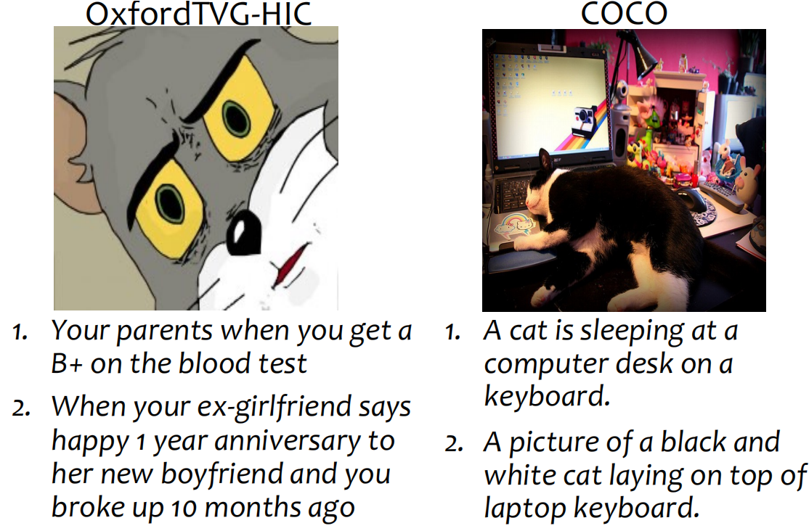

# OxfordTVG-HIC
[](https://arxiv.org/abs/2307.11636)

## Dataset Exploration
 

## Introduction
This paper presents Oxford HIC, a large-scale dataset for humour generation and understanding. Humour is an abstract, subjective, and context-dependent cognitive construct involving several cognitive factors, making it a challenging task to generate and interpret. Hence, humour generation and understanding can serve as a new task for evaluating the ability of deep-learning methods to process abstract and subjective information.
Due to the scarcity of data, humour-related generation tasks such as captioning remain under-explored.
To address this gap, Oxford HIC offers approximately 2.9M image-text pairs with humour scores to train a generalizable humour captioning model.
Contrary to existing captioning datasets, Oxford HIC features a wide range of emotional and semantic diversity resulting in out-of-context examples that are particularly conducive to generating humour. Moreover, Oxford HIC is curated devoid of offensive content.
We also show how Oxford HIC can be leveraged for evaluating the humour of a generated text. 
Through explainability analysis of the trained models, we identify the visual and linguistic cues influential for evoking humour prediction (and generation). We observe qualitatively that these cues are aligned with the benign violation theory of humour in cognitive psychology.


## Dataset download
Download the dataset from [Oxford_HIC](https://drive.google.com/drive/folders/1BDuUcMeaWrFD8TwgHLhFPkuAwmoHaVNQ) 
or directly running the follong scripts to download meta-data and images simultianeously (make sure you have [Gdown](https://github.com/wkentaro/gdown) in your environment). 

```
cd data
bash data_download_data.sh
```

This will automatically downlod images and captions to data/hic_data


## Demo weight download
Download the pre-trained checkpoints on MiniGPT4 and CLIPCap

|                                MiniGPT4                                |                               CLIPCap                              |
:------------------------------------------------------------------------------------------------:|:----------------------------------------------------------------------------------------------:
 [Downlad](https://drive.google.com/file/d/1a4zLvaiDBr-36pasffmgpvH5P7CKmpze/view?usp=share_link) | [Download](https://drive.google.com/file/d/1lwI3T81QtbVtIcJ7jsRxdxBI1bh_4wy7/view?usp=sharing) 


We recommend trying MiniGPT4 first since it has quite a strong abstract understanding ability derived from its Large Language Model decoder (Vicuna), which facilitates humour generation and understanding. Suppose you download the pth file in the path MODEL_DIR


## Citing

If you found this repository useful, please consider citing:

```bibtex
@misc{li2023oxfordtvghic,
      title={OxfordTVG-HIC: Can Machine Make Humorous Captions from Images?}, 
      author={Runjia Li and Shuyang Sun and Mohamed Elhoseiny and Philip Torr},
      year={2023},
      eprint={2307.11636},
      archivePrefix={arXiv},
      primaryClass={cs.CV}
}

```


